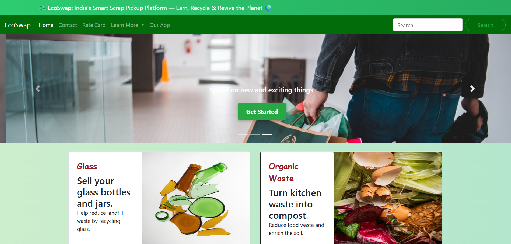

# 🌍 **EcoSwap – India's Smart Scrap Management Platform** ♻️

**🚀 Live Site:** [https://ecoswap-world.netlify.app](https://ecoswap-world.netlify.app/)

EcoSwap is a modern, user-friendly web platform aimed at making **recycling easier, accessible, and rewarding** for everyone. Whether you're a household or a business, EcoSwap empowers you to schedule pickups for recyclable materials — while promoting environmental responsibility and awareness.

---

## ✅ **Key Features**

- 🗓️ **Pickup Request Form**  
  Users can book scrap pickups with name, phone, address, items, and estimated quantity.
  
- 🌿 **CO₂ Savings Calculator**  
  Shows estimated carbon savings per pickup based on material type.

- 🏆 **Leaderboard** *(Gamified Impact)*  
  Displays top CO₂ savers to encourage eco-responsible behavior.

- 🗣️ **Multilingual Support**  
  Toggle content between **English**, **हिन्दी**, and **मराठी**.

- 🔥 **Firebase Integration**  
  Realtime database stores pickup requests securely.

- 📬 **EmailJS Confirmation** *(WIP)*  
  Sends email upon form submission (*under integration*).

- 📱 **Mobile-Responsive UI**  
  Fully responsive on desktop and mobile devices.

---

## 📸 **Screenshots**

| Homepage |
|---------------------|
|  |

---

## 🔧 **Tech Stack**

- **Frontend:** HTML5, CSS3, Bootstrap 4
- **Database:** Firebase Realtime Database
- **Email Service:** EmailJS *(optional, in-progress)*
- **Deployment:** [Netlify](https://www.netlify.com/)

---

## 💡 **Upcoming Enhancements**

- 📊 Live impact dashboard with real-time data
- 📍 Map-based scrap vendor dashboard
- 💬 WhatsApp integration for bookings
- 🎥 Testimonial & story sections with user videos
- 🔐 OTP-based vendor login

---

## 👤 **Author**

**Gulam Dastgir Shaikh**  
_AI & Data Science Student_  
**Green Intern @ 1M1B | Tech for Good Advocate |**  
🔗 [LinkedIn Profile](https://in.linkedin.com/in/gulam-shaikh)

---

## 📃 **Note**

This project is developed as part of the **1M1B Green Internship Initiative** and is made for educational purpose & inspired from expert sources. For contributions or feedback, feel free to reach out via [LinkedIn](https://in.linkedin.com/in/gulam-shaikh).

---

## 🖇️ Quick Links

- 🔗 [Live Project on Netlify](https://ecoswap-world.netlify.app/)
- 📁 [GitHub Repository](https://github.com/gulamshaikh/EcoSwap)

---

> _“Recycle today for a better tomorrow.” – Let EcoSwap be your step toward a cleaner India._ 🇮🇳

